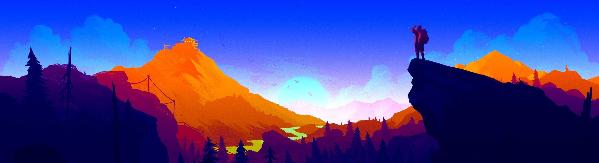

[comment]: 
<h1 align="center">Hi there  I'm Carlos Tabangay - aka RedDotz <h3 align="center">React JS Developer</h3></h1>

  

### I'm a Computer Science student and self-taught developer.

-   ⚒ I’m currently working on my **Front-End Skills**.
-   🌱 I’m currently learning React Query and Next JS.
-   💬 Ask me about **React, HTML, CSS, JavaScript**.
-   🤝 Looking forward to collaborate with other projects.
-   🤔 I’m looking for help with other web frameworks.
-   🎯 Current Goal: build projects
-   ⚡ Fun fact: My Personality Type is **_INFJ_**.
-   📫 How to reach me: **carlos_tabangay@outlook.com**

#### Connect with me:

#### Top Technologies:

---

  
  

  

 
  

---
